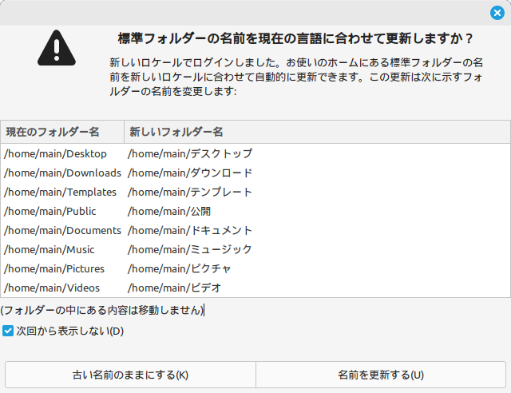
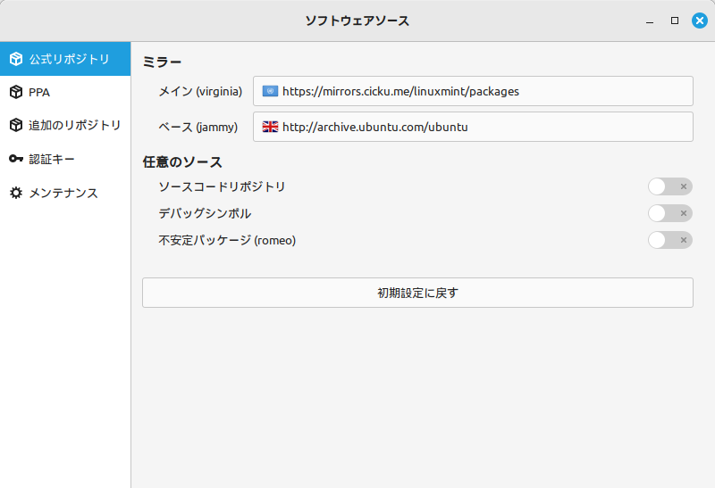

# Mint Linux

## 1. フォルダ名を英語に変換

これは GUI の操作が入る

```bash
LANG=C xdg-user-dirs-update --force
```

このコマンドを実行したら再起動をする

```bash
sudo shutdown -r now
```

再起動をすると以下のような画面が表示さるので「次から表示しない」にチェックをいれて「古い名前のままにする」を選択する。



以下で変わっているかが確認できる
```bash
cat ~/.config/user-dirs.dirs
```

## 2. ソフトウェアソースの変更

メインを以下に変更する。

`https://mirrors.cicku.me/linuxmint/packages`



## 3. apt update 6 upgrade

```bash
sudo apt update
sudo apt upgrade -y
```

## 4. git をインストール

```bash
sudo apt install git -y
git config --global user.name "$USERNAME"
git config --global user.email "$EMAIL"

```


## 5. ip を固定

connection で指定すると永続化する。device で指定すると一時的になる。

```bash
# ネットワークインターフェースの確認
nmcli device
# 現在の接続名の確認
nmcli connection show

# ip の設定
nmcli connection modify "$CONNECTION_NAME" ipv4.addresses 192.168.1.100/24
nmcli connection modify "$CONNECTION_NAME" ipv4.gateway 192.168.1.1
nmcli connection modify "$CONNECTION_NAME" ipv4.method mamual

# DNS の設定
nmcli connection modify "$CONNECTION_NAME" ipv4.dns "8.8.8.8 8.8.4.4"
nmcli connection modify "$CONNECTION_NAME" ipv4.ignore-auto-dns yes

# 接続を再起動
nmcli connection down "$CONNECTION_NAME" && nmcli connection up "$CONNECTION_NAME"
```


## 6. SSH の設定

```bash
sudo apt -y install openssh-server
```

クライアントにて以下で接続する。  
この時パスワードによる接続をする。

```bash
ssh ${username}@${ip}
```

以下のようなエラーが発生した場合

```text
@@@@@@@@@@@@@@@@@@@@@@@@@@@@@@@@@@@@@@@@@@@@@@@@@@@@@@@@@@@
@    WARNING: REMOTE HOST IDENTIFICATION HAS CHANGED!     @
@@@@@@@@@@@@@@@@@@@@@@@@@@@@@@@@@@@@@@@@@@@@@@@@@@@@@@@@@@@
IT IS POSSIBLE THAT SOMEONE IS DOING SOMETHING NASTY!
Someone could be eavesdropping on you right now (man-in-the-middle attack)!
It is also possible that a host key has just been changed.
The fingerprint for the ED25519 key sent by the remote host is
SHA256:${xxxx}.
Please contact your system administrator.
Add correct host key in ${xxxx} to get rid of this message.
Offending ED25519 key in ${xxxx}
Host key for ${ip} has changed and you have requested strict checking.
Host key verification failed.
```

以下のコマンドを実行して削除する。

```bash
ssh-keygen -R ${ip}
```

公開鍵暗号方式に変更する。

```bash
# クライアント側
cd ~
scp ./.ssh/id_ecdsa.pub ${username}@${ip}:~/
ssh ${username}@${ip}
mkdir -p ~/.ssh

# ここからサーバー側
cat ~/id_ecdsa.pub >> ~/.ssh/authorized_keys
chmod 700 ~/.ssh
chmod 600 ~/.ssh/authorized_keys
rm ~/id_ecdsa.pub

sudo nano /etc/ssh/sshd_config
```

とりあえず以下だけ設定

```config
PasswordAuthentication no
PermitEmptyPasswords no
```

```bash
sudo service sshd restart
# ssh を出る
exit
```

```bash
# クライアント側でもう一度は入れるか確認
ssh ${username}@${ip}
```

## 7. CUDA のインストール

以下のページにインストールコマンドがある

[CUDA Toolkit 12.1 Downloads](https://developer.nvidia.com/cuda-downloads?target_os=Linux&target_arch=x86_64&Distribution=Ubuntu&target_version=22.04&target_type=deb_network)

### Base Installer

CUDA Toolkit のインストール

```bash
wget https://developer.download.nvidia.com/compute/cuda/repos/ubuntu2204/x86_64/cuda-keyring_1.1-1_all.deb
sudo dpkg -i cuda-keyring_1.1-1_all.deb
sudo apt update
# PyTorch を使用するため 12.1 をインストールする(2024-06-30)
sudo apt -y install cuda-toolkit-12-1
```

### Driver Installer

Driver のインストール

安定を求める場合は legacy kernel module flavor を選択し、オープンで先進的なものを求める場合は open kernel module flavor をインストールする。

ここでは legacy kernel module flavor をインストールする。

```bash
sudo apt install -y cuda-drivers
```

### 環境変数の設定

[1. Introduction — Installation Guide for Linux 12.5 documentation](https://docs.nvidia.com/cuda/cuda-installation-guide-linux/index.html#environment-setup)

以下を `~/.bashrc` に追加する

```bash
nano ~/.bashrc
```

```bash
export PATH=/usr/local/cuda-12.1/bin${PATH:+:${PATH}}
# 64bit OS用
export LD_LIBRARY_PATH=/usr/local/cuda-12.1/lib64${LD_LIBRARY_PATH:+:${LD_LIBRARY_PATH}}
```

* `${PATH:+:${PATH}}` という書き方は `PATH` が存在しないときに空文字となる指定の方法

```bash
source ~/.bashrc
```

```bash
# インストールが終わったら一度再起動する
sudo shutdown -r now
```

インストールが完了しているか確認

```bash
nvcc --version
sudo nvidia-smi
```


## Python

### Pyenv のインストール

[GitHub - pyenv/pyenv: Simple Python version management](https://github.com/pyenv/pyenv/tree/master?tab=readme-ov-file#basic-github-checkout)

```bash
git clone https://github.com/pyenv/pyenv.git ~/.pyenv
# これはどっちでもいい
cd ~/.pyenv && src/configure && make -C src
```

環境変数の設定は以下になるので `~/.bashrc` に設定する。

```bash
echo 'export PYENV_ROOT="$HOME/.pyenv"' >> ~/.bashrc
echo 'command -v pyenv >/dev/null || export PATH="$PYENV_ROOT/bin:$PATH"' >> ~/.bashrc
echo 'eval "$(pyenv init -)"' >> ~/.bashrc
source ~/.bashrc
```

pyenv でインストールをする場合は build の依存関係を解決する必要があるため以下のパッケージもインストールする。

[Home](https://github.com/pyenv/pyenv/wiki#suggested-build-environment)

```bash
sudo apt update; sudo apt -y install build-essential libssl-dev zlib1g-dev \
libbz2-dev libreadline-dev libsqlite3-dev curl git \
libncursesw5-dev xz-utils tk-dev libxml2-dev libxmlsec1-dev libffi-dev liblzma-dev
```

以下のコマンドでインストールが完了しているか確認する。
```bash
pyenv --version
pyenv install --list
```

pyenv を更新するための便利コマンドがあるのでついでにインストールをしておく。

```bash
git clone https://github.com/pyenv/pyenv-update.git $(pyenv root)/plugins/pyenv-update
```

以下を実行することで更新される。

```bash
pyenv update
```

[コマンドリファレンス](https://github.com/pyenv/pyenv/blob/master/COMMANDS.md#command-reference)


### Python のインストール

とりあえず最新をインストールしておく。

```bash
pyenv install 3.12.4
pyenv global 3.12.4
pyenv rehash

# 以下のコマンドでインストールできているかを確認
python --version
```

### pipx のインストール

pipx は独立したアプリケーションやツールのインストールや管理に便利なツール。

[GitHub - pypa/pipx: Install and Run Python Applications in Isolated Environments](https://github.com/pypa/pipx?tab=readme-ov-file#on-linux)

```bash
sudo apt update
sudo apt install -y pipx

# ~/.local/bin のパスを .bashrc に追加
pipx ensurepath
source ~/.bashrc
```

### Poetry のインストール

Pipenv よりも管理機能が豊富で早い仮想環境管理ツール。

[Introduction | Documentation | Poetry - Python dependency management and packaging made easy](https://python-poetry.org/docs/#installation)

```bash
pipx install poetry
# 以下でインストールされたことを確認
poetry --version

# タブ補完を有効化
poetry completions bash >> ~/.bash_completion
```
