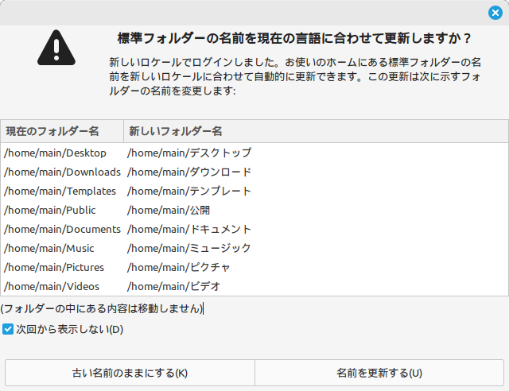
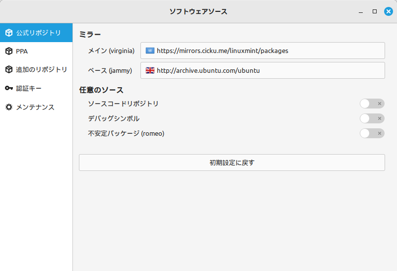

# Mint Linux

## 1. フォルダ名を英語に変換

これは GUI の操作が入る

```bash
LANG=C xdg-user-dirs-update --force
```

このコマンドを実行したら再起動をする

```bash
sudo shutdown -r now
```

再起動をすると以下のような画面が表示さるので「次から表示しない」にチェックをいれて「古い名前のままにする」を選択する。



以下で変わっているかが確認できる
```bash
cat ~/.config/user-dirs.dirs
```

## 2. ソフトウェアソースの変更

メインを以下に変更する。

`https://mirrors.cicku.me/linuxmint/packages`



## 3. apt update 6 upgrade

```bash
sudo apt update
sudo apt upgrade -y
```

## 4. git をインストール

```bash
sudo apt install git -y
git config --global user.name "$USERNAME"
git config --global user.email "$EMAIL"

```


## 5. ip を固定

connection で指定すると永続化する。device で指定すると一時的になる。

```bash
# ネットワークインターフェースの確認
nmcli device
# 現在の接続名の確認
nmcli connection show

# ip の設定
nmcli connection modify "$CONNECTION_NAME" ipv4.addresses 192.168.1.100/24
nmcli connection modify "$CONNECTION_NAME" ipv4.gateway 192.168.1.1
nmcli connection modify "$CONNECTION_NAME" ipv4.method mamual

# DNS の設定
nmcli connection modify "$CONNECTION_NAME" ipv4.dns "8.8.8.8 8.8.4.4"
nmcli connection modify "$CONNECTION_NAME" ipv4.ignore-auto-dns yes

# 接続を再起動
nmcli connection down "$CONNECTION_NAME" && nmcli connection up "$CONNECTION_NAME"
```


## 6. SSH の設定

```bash
sudo apt -y install openssh-server
```

クライアントにて以下で接続する。  
この時パスワードによる接続をする。

```bash
ssh ${username}@${ip}
```

以下のようなエラーが発生した場合

```text
@@@@@@@@@@@@@@@@@@@@@@@@@@@@@@@@@@@@@@@@@@@@@@@@@@@@@@@@@@@
@    WARNING: REMOTE HOST IDENTIFICATION HAS CHANGED!     @
@@@@@@@@@@@@@@@@@@@@@@@@@@@@@@@@@@@@@@@@@@@@@@@@@@@@@@@@@@@
IT IS POSSIBLE THAT SOMEONE IS DOING SOMETHING NASTY!
Someone could be eavesdropping on you right now (man-in-the-middle attack)!
It is also possible that a host key has just been changed.
The fingerprint for the ED25519 key sent by the remote host is
SHA256:${xxxx}.
Please contact your system administrator.
Add correct host key in ${xxxx} to get rid of this message.
Offending ED25519 key in ${xxxx}
Host key for ${ip} has changed and you have requested strict checking.
Host key verification failed.
```

以下のコマンドを実行して削除する。

```bash
ssh-keygen -R ${ip}
```

公開鍵暗号方式に変更する。

```bash
# クライアント側
cd ~
scp ./.ssh/id_ecdsa.pub ${username}@${ip}:~/
ssh ${username}@${ip}
mkdir -p ~/.ssh

# ここからサーバー側
cat ~/id_ecdsa.pub >> ~/.ssh/authorized_keys
chmod 700 ~/.ssh
chmod 600 ~/.ssh/authorized_keys
rm ~/id_ecdsa.pub

sudo nano /etc/ssh/sshd_config
```

とりあえず以下だけ設定

```config
PasswordAuthentication no
PermitEmptyPasswords no
```

```bash
sudo service sshd restart
# ssh を出る
exit
```

```bash
# クライアント側でもう一度は入れるか確認
ssh ${username}@${ip}
```
